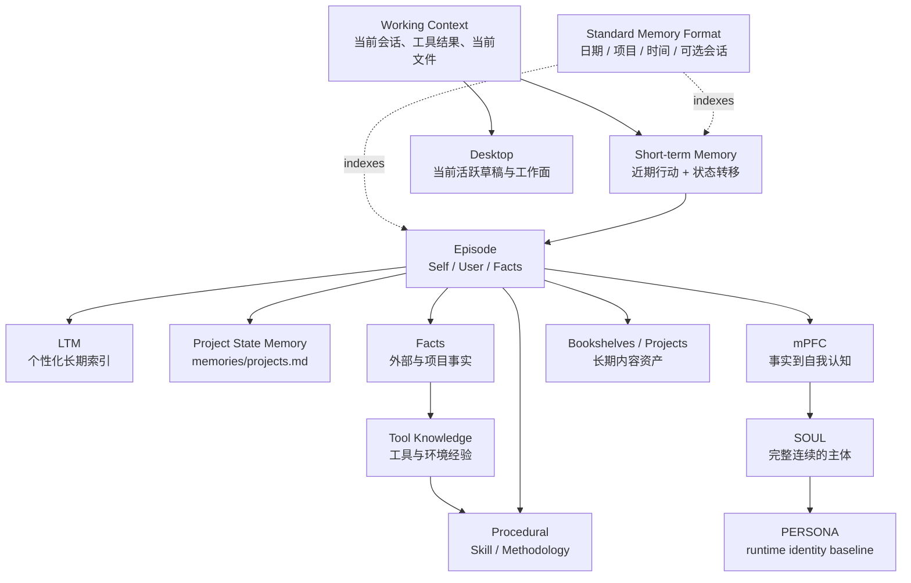
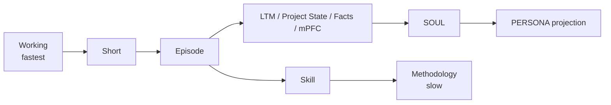
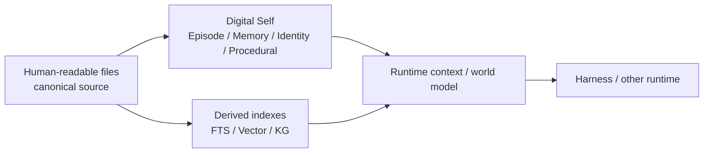

# Persistent Agent Identity Cycle Architecture

这套架构把长期数字助手理解为一个持续工作的文件型主体：Working Context 负责即时工作，Short-term Memory 保持固定周期内的近期连续性，Episode 保存能够被长期抽象重新解释的事实来源，Long-term Memory、项目状态、Facts 与 mPFC 分别形成关于用户、工作状态、外部世界和自身的较慢认识，SOUL 将 mPFC 压缩成连续主体，PERSONA 再把 SOUL 投影成运行时可执行的身份基线，Procedural 则把实践中反复验证的方法沉淀为 Skill 与 Methodology。

Short 与 Episode 共用标准索引：`[日期][项目][时间]<会话(optional)>`。索引只负责定位实践，正文仍以自然语言保存行动、状态和事实链。

## 变化速度

Working Context 随推理和工具调用不断变化；Short-term Memory 每次完整的用户交互与 Agent 实践结束后压缩一次，只保留固定周期内仍然活跃的项目和会话；Episode 在周期性 Reflection 中从 Short 归档出来，作为后续较慢结构的事实来源；Long-term Memory、项目状态、Facts 和 mPFC 按各自使用频率更新；SOUL 低频压缩 mPFC，PERSONA 从 SOUL 中提取长期值得进入运行时身份的内容；Skill 根据真实实践较快修订，而 Methodology 只有跨任务反复成立时才缓慢变化。

## 文件型主体与外部认知基础设施

人类可读文件是长期内容的 canonical source。Markdown 文档可以直接被用户和 Agent 共同维护，并通过 Git 保存形成历史；知识图谱、向量索引、全文索引和 Runtime World Model 可以作为派生或运行时基础设施接入，但不需要成为 Identity 本体。这样即使更换 Harness、检索技术或图数据库，Episode、Memory、Facts、mPFC、SOUL、PERSONA 与 Procedural 仍然能够迁移。

## Reflection 的位置

Reflection 采用一个主 Skill 作为入口。主 `SKILL.md` 组织 Short、Episode、Memory、Facts、Identity 与 Procedural 的路由，`references/` 描述这些目标文件如何保存和变化；只有某条内部流程复杂到值得独立加载时才增加 `workflows/`。如果未来 Harness 支持 namespace，同一结构可以自然演化出 `reflection.identity`、`reflection.procedural` 等内部路由，同时保持一个清晰的能力入口。
