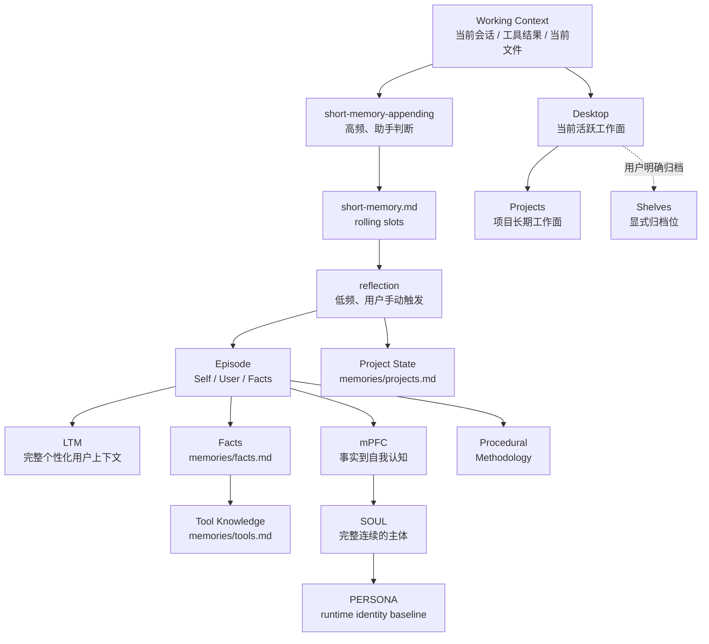
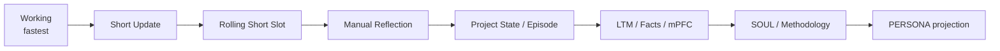

# Persistent Agent Identity Cycle Architecture

这套架构把长期数字助手理解为一个持续工作的文件型主体，并把“近期连续性落盘”和“较慢的长期整理”拆成两个不同频率、不同触发主体的能力。Working Context 负责即时工作；`short-memory-appending` 在一次完整用户交互与 Agent 实践结束后，由助手自行判断是否调用，并在需要时维护根目录 `short-memory.md` 中对应项目/会话的 rolling slot；`reflection` 只在用户明确手动触发时运行，将尚未反思的 Short 推进到 Project State、Episode、Long-term Memory、Facts、Identity 与 Procedural。

Short 与 Episode 共用基础索引 `[日期][项目[:会话]][时间]`。Short 额外追加 `[reflection:pending|done]`。项目/会话这一格按第一个 `:` 区分 project 与 session，session 内可以继续使用冒号表达稳定层级。同一项目/会话只维护一个 rolling Short slot；同一项目的不同会话彼此相邻，但 `short-memory.md` 本身保持扁平自然排列。

## 两个不同频率的维护过程

Short Memory Maintenance 与 Reflection 不再是两个“每轮都要判断”的步骤。对大多数包含实际工作、状态变化、纠正或未完成事项的交互，助手通常会在一轮结束后调用一次 `short-memory-appending`；简单寒暄或完全没有连续性价值的交互可以跳过。Reflection 不由 Agent 自主触发，也不由阈值或 scheduler 触发；pending Short 会一直保留，直到用户明确要求 Reflection。

Short 的维护方式是滚动更新。同一项目/会话如果还处于 `reflection:pending`，下一轮必须把上一轮唯一 latest body 压缩为一条 `- [YYYY-MM-DD HH:mm:ss] ...` 日志，已有日志原样保留，然后删除旧正文并写入一个新的唯一 latest body。Short 只保存恢复当前工作线所必需的变化、动作、状态、未收口项和文件入口；研究来源、逐条论证、工具流水等由对应文件承载。

如果当前 slot 已经是 `reflection:done`，下一次实质更新会开始新的 pending 周期；done stub 和已反思历史都不会重新进入 pending 日志。

用户手动触发 Reflection 后，Reflection 同时读取一个 pending slot 的压缩日志与 latest body，完成慢层路由后删除这些 pending 细节，只保留一句 `reflection:done` stub。Reflection 还承担已完成 Short 的时间型维护：依据部署已有 retention policy 删除超期且不活跃的 done slots；仍在保留期但沿用旧格式、包含大量正文的 legacy done slots 只规范化为 stub，不重新反思。如果没有配置 retention horizon，则不自行发明时间窗口。

当 Harness 支持 Subagent 时，Short 维护优先与当前实际工作 Worker 合并；没有工作型 Worker、但本轮仍值得记忆时，才使用 memory-only Worker。Reflection 在用户手动触发后使用独立 Worker。父 Agent 只保留对话、判断和委派结果。

## Assistant Home 的写入边界

Assistant Home 内普通 Worker 默认只能直接写 `desktop/**` 与 `projects/**`。读取其他持久目录可以按任务需要进行，但修改 `shelves/**`、`research/**`、`memories/**`、`episodes/**`、`identity/**`、`procedural/**`、`.agents/**`、`logs/**` 或其他持久层需要用户在当前任务中的明确授权。

有两个维护例外：`short-memory-appending` 只额外获得 `short-memory.md` 的维护权限；用户手动触发 Reflection 时，该请求授权 Reflection Skill 定义的 Short、Memory、Episode、Identity、Procedural 与 Project State 目标。Reflection 不因此获得 Shelves、Research、Logs 或任意 Skill 文件的写权限。

Desktop 是当前活跃工作面，Shelves 是归档位。新讨论、研究、整理内容必须先形成 Desktop 工作稿；用户明确要求归档后，才从 Desktop 整理进入 Shelves。归档完成且不再需要继续编辑时，工作稿默认移出 Desktop；只有仍承担活跃工作入口时才保留副本。唯一允许跳过 staging 直接写 Shelves 的普通场景，是用户明确要求修订某一份已经存在的 Shelves 旧文档。

这套边界只约束 Assistant Home，不限制用户明确交付的外部代码仓库或普通工作目录。

## 从快到慢

Project State 与 Episode 不是严格串行关系。项目当前阶段、最近结果和恢复入口可以由 Reflection 直接根据 Short 的最新状态更新；Episode 保存未来仍值得重新解释的长期事实来源。

## 文件型核心与外部认知基础设施

人类可读文件是长期内容的 canonical source。当前实现使用一个配置好的绝对 `<ASSISTANT_HOME>` 作为唯一持久工作区，Short 直接位于根目录，较慢内容进入 `memories/`、`episodes/`、`identity/`、`procedural/` 与其他长期目录。当前不为每个项目创建独立本地记忆。

Knowledge Graph、向量索引、全文索引和 Runtime World Model 都属于可替换的外部认知基础设施，它们可以增强检索和上下文装配，但不参与定义长期主体本身。

## Runtime 加载

正常运行时不需要把所有长期文件一次性装进 Working Context。Harness 的 Agent Mode Prompt 应先加载 PERSONA、Short 与 Long-term Memory，再根据当前任务决定是否加载 Project State、Tool Knowledge、Facts、Skills、Bookshelves 或正式 Project 文件；Episode、mPFC 与 SOUL 主要在手动 Reflection、Identity 维护或明确需要追溯形成过程时读取。当前 DSH 适配提示词保存在 `.dsh/agent-mode-prompt.md`。
