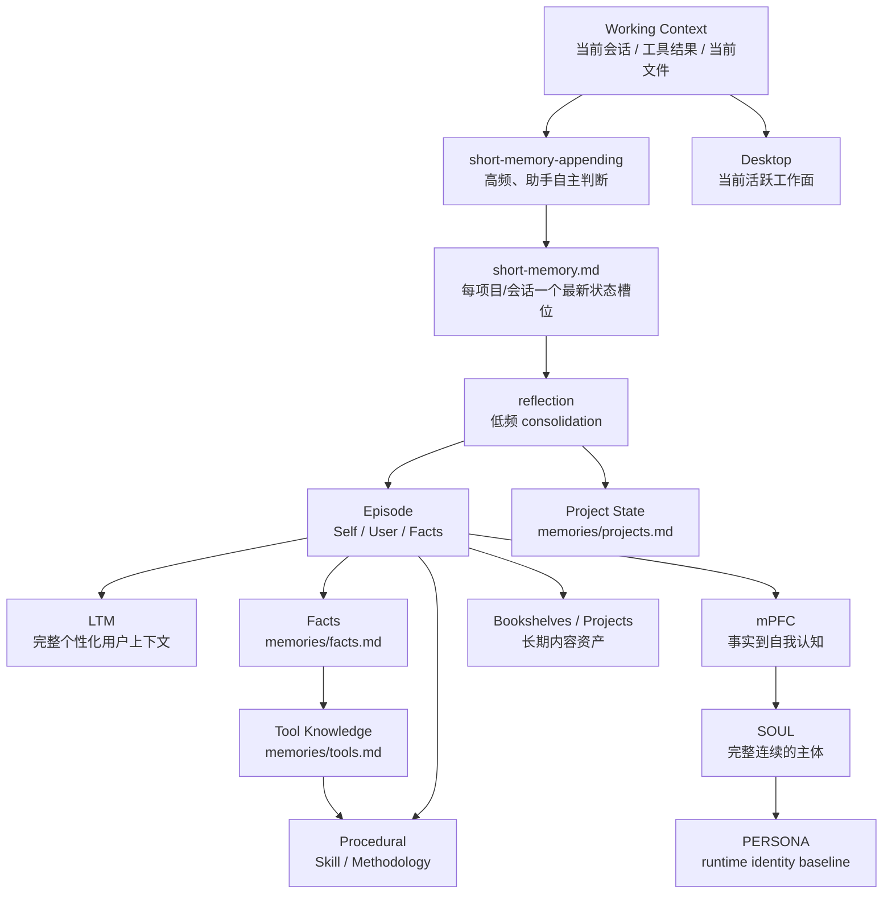
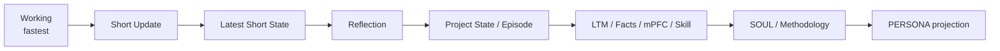
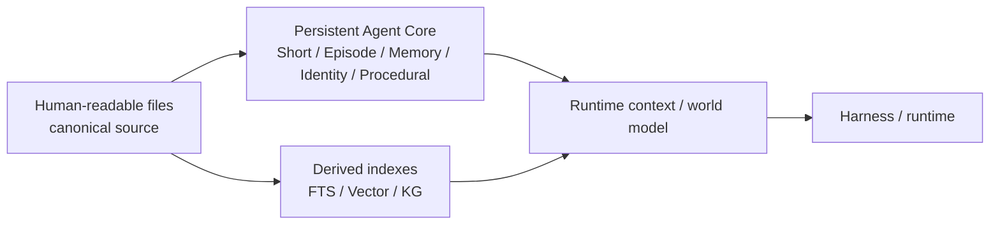

# Persistent Agent Identity Cycle Architecture

这套架构把长期数字助手理解为一个持续工作的文件型主体，并把“近期连续性落盘”和“较慢的长期整理”拆成两个不同频率的能力。Working Context 负责即时工作；`short-memory-appending` 在一次完整用户交互与 Agent 实践结束后，由助手自行判断是否调用，并在需要时维护根目录 `short-memory.md` 中对应项目/会话的最新状态；`reflection` 则只在值得立即整理、用户主动要求或周期性任务触发时运行，将 Short 中尚未反思的当前内容继续推进到项目状态、Episode、Long-term Memory、Facts、Identity 与 Procedural。

Short 与 Episode 共用基础索引 `[日期][项目][时间][会话?]`。Short 在其后追加 `[reflection:pending|done]`。同一项目/会话在 Short 中只保留一条最新记录；新的实践会重写这一槽位、更新时间并重新标记为 `pending`，旧状态不会继续作为 Short 历史保留。

## 两个不同频率的维护过程

Short Memory Appending 与 Reflection 是两个独立决策。对大多数包含实际工作、状态变化、纠正或未完成事项的交互，助手通常会在一轮结束后调用一次 `short-memory-appending`；简单寒暄或完全没有连续性价值的交互可以不调用。这个判断属于 Agent 自身，不额外增加一个写入前过滤器，也不会把每次工具调用拆成独立 Short。

Short 的维护方式是更新，而不是不断累积同一工作上下文的历史快照。若当前项目/会话已经存在记录，本轮会直接重写该记录，使正文只表达最近值得保留的行动以及当前状态；仍然有效的信息可以被带入新版本，已经过时的行动和状态则被丢弃。没有对应槽位时才创建新记录。

Reflection 不需要紧跟每一次 Short 更新。当前记录每次发生实质更新后都标记为 `reflection:pending`；当其中包含应该立即进入慢层的重要变化时，助手可以主动触发 Reflection，也可以留到后续交互、用户显式要求或周期调度中处理。Reflection 完成检查后将当前版本标记为 `reflection:done`；如果之后同一项目/会话再次发生变化，新版本会重新成为 `pending`。

当 Harness 支持 Subagent 时，这两个维护过程都优先交给短生命周期子代理执行。父 Agent 只提供本轮必要证据、绝对 Assistant Home 路径和当前项目/会话标签，并只接收简短结果，从而让当前工作上下文尽量保留给用户任务本身。

## 从快到慢

Project State 与 Episode 在这里不是严格串行关系。项目当前阶段、最近结果和恢复入口可以由 Reflection 直接根据 Short 更新，以避免等待 Episode 归档后才获得最新状态；Episode 则保存未来仍值得重新解释的长期事实来源。

## 文件型核心与外部认知基础设施

人类可读文件是长期内容的 canonical source。当前实现使用一个配置好的绝对 `<ASSISTANT_HOME>` 作为唯一持久工作区，Short 直接位于根目录，较慢内容进入 `memories/`、`episodes/`、`identity/`、`procedural/` 与其他长期目录。当前不为每个项目创建独立本地记忆；如果未来需要多 Workspace，再单独扩展这层设计。

Knowledge Graph、向量索引、全文索引和 Runtime World Model 都属于可替换的外部认知基础设施，它们可以增强检索和上下文装配，但不参与定义长期主体本身。

## Runtime 加载

正常运行时不需要把所有长期文件一次性装进 Working Context。Harness 的 Agent Mode Prompt 应先加载 PERSONA、Short 与 Long-term Memory，再根据当前任务决定是否加载 Project State、Tool Knowledge、Facts、Skills、Bookshelves 或正式 Project 文件；Episode、mPFC 与 SOUL 主要在 Reflection、Identity 维护或明确需要追溯形成过程时读取。当前 DSH 适配提示词保存在 `.dsh/agent-mode-prompt.md`。
