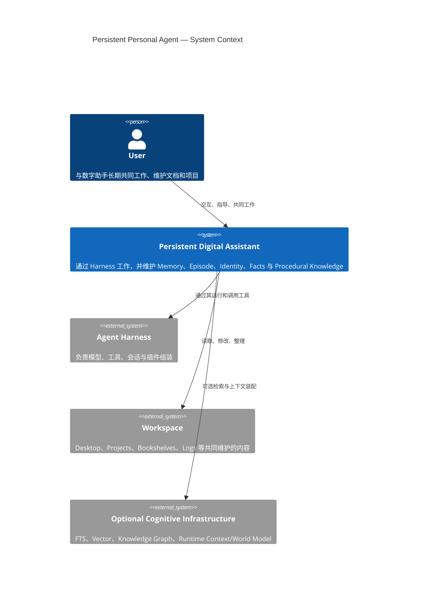
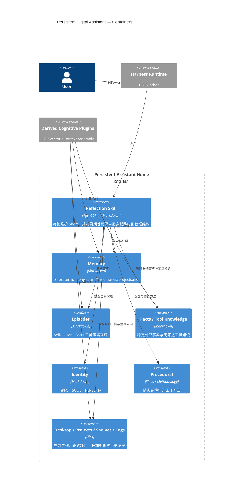
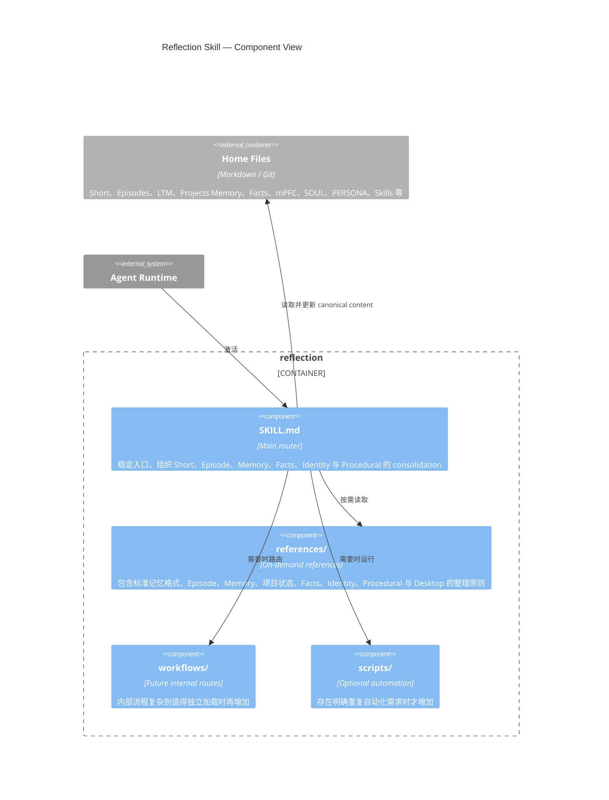

# C4 Views

本文件用 C4 视角描述长期数字助手与 Reflection Skill 的系统边界。Knowledge Graph、向量索引和 Runtime World Model 被视为外部认知基础设施，它们可以增强检索和上下文装配，但不属于长期主体自身的 canonical content。

## Level 1 — System Context

## Level 2 — Containers

## Level 3 — Reflection Skill Components

这些视图强调一个稳定边界：Reflection Skill 属于长期助手自身的演化机制，而 Knowledge Graph、Vector Store、Runtime World Model 和具体 Harness 都可以替换；长期连续性由人类可读文件和它们的版本历史保存。
