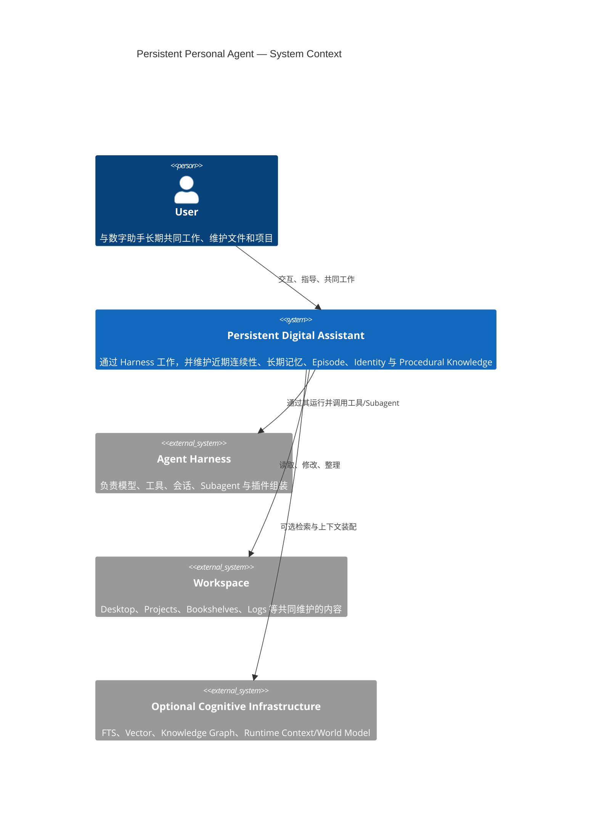
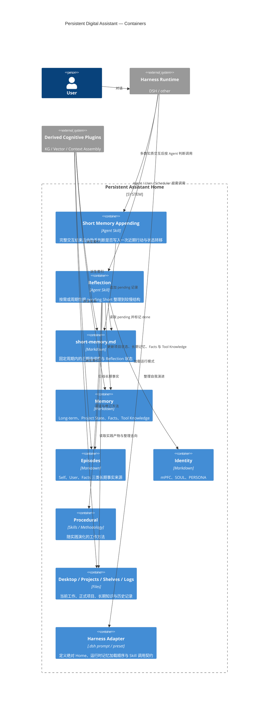
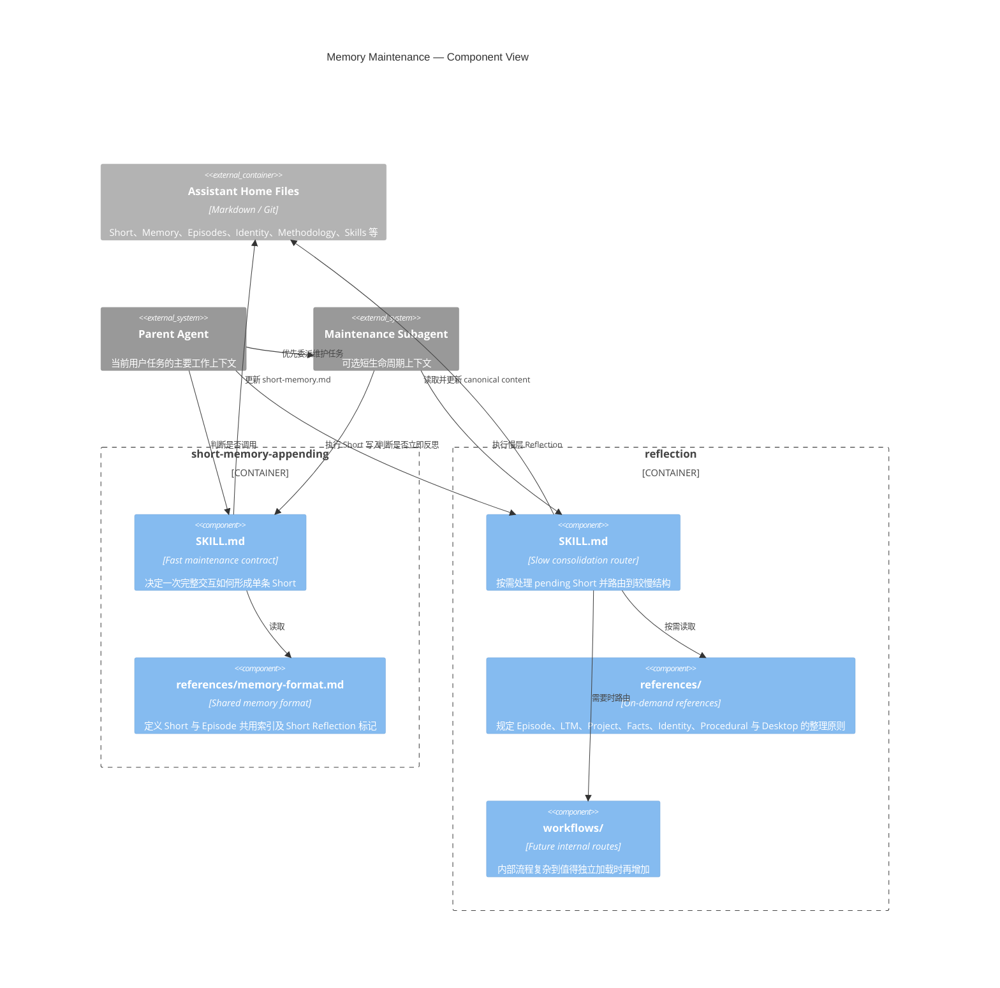

# C4 Views

本文件用 C4 视角描述长期数字助手、Short Memory Appending 与 Reflection 的系统边界。Knowledge Graph、向量索引和 Runtime World Model 仍然属于外部认知基础设施；当前持久主体通过一个配置好的绝对 Assistant Home 工作，不为每个项目创建独立本地记忆。

## Level 1 — System Context

## Level 2 — Containers

## Level 3 — Maintenance Skill Components

两个 Skill 的拆分来自不同的运行频率和上下文成本，而不是把同一 Reflection 过程机械拆碎。Short Memory Appending 接近自动维护，但仍由 Agent 决定是否需要写；Reflection 保留更强的主体判断，可以立即执行，也可以等待更多实践积累后再运行。
