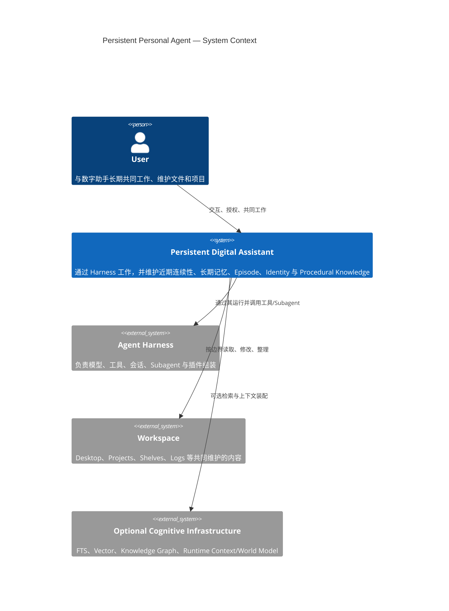
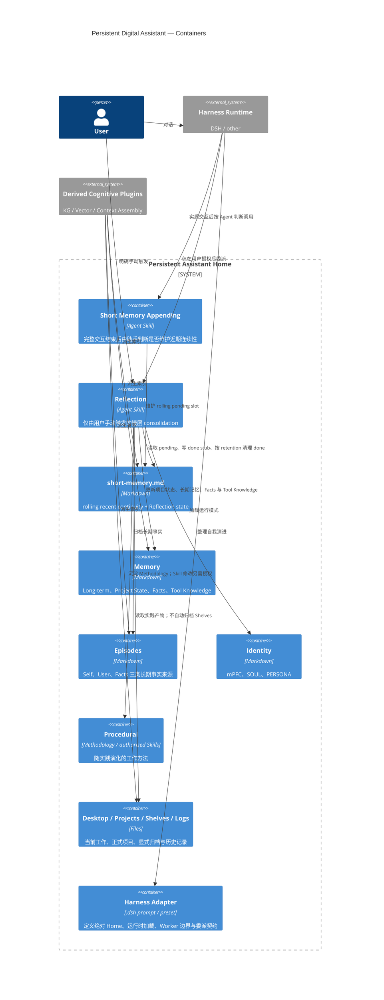
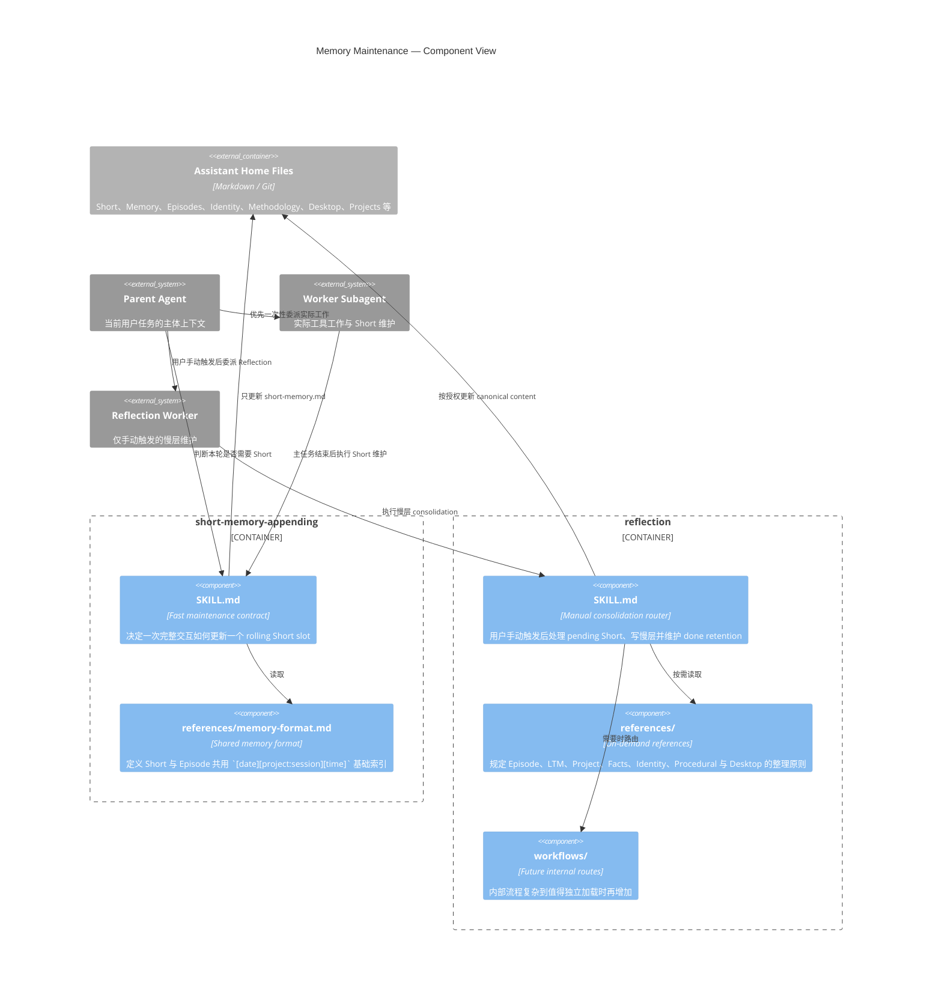

# C4 Views

本文件用 C4 视角描述长期数字助手、Short Memory Appending 与 Reflection 的系统边界。Knowledge Graph、向量索引和 Runtime World Model 属于外部认知基础设施；当前持久主体通过一个配置好的绝对 Assistant Home 工作，不为每个项目创建独立本地记忆。

## Level 1 — System Context

## Level 2 — Containers

## Level 3 — Maintenance Skill Components

两个 Skill 的拆分来自不同的运行频率、触发主体和上下文成本。Short Memory Appending 接近自动维护，但仍由 Agent 判断是否需要写；Reflection 不再保留 Agent 自主或周期调度入口，只在用户明确要求时执行。

Assistant Home 内的普通 Worker 默认只直接写 `desktop/**` 与 `projects/**`；Short 和手动 Reflection 是目的受限的维护例外。Shelves 新内容必须先经过 Desktop staging，并在用户明确归档后进入；归档完成且工作稿不再活跃时，默认移出 Desktop。
