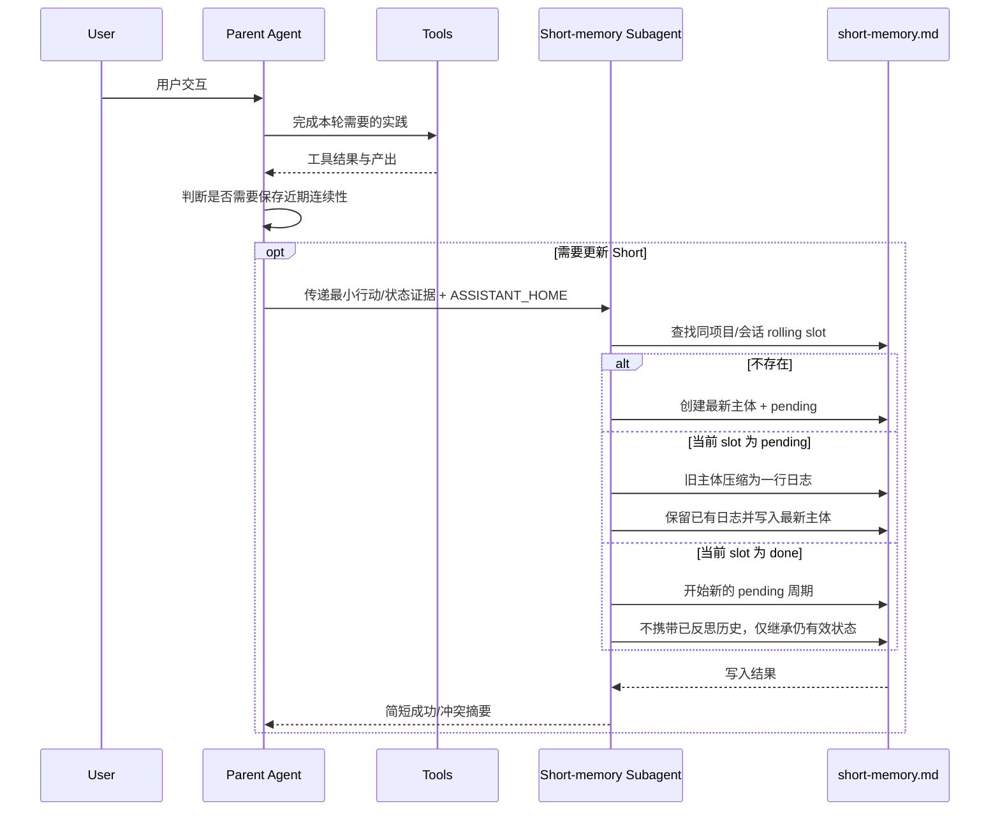
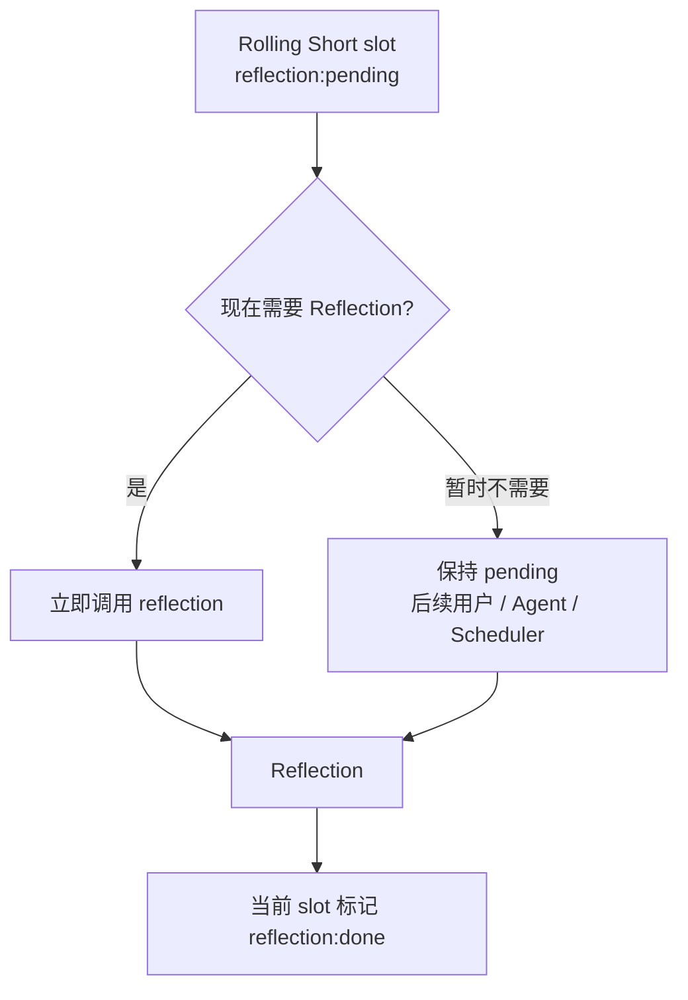
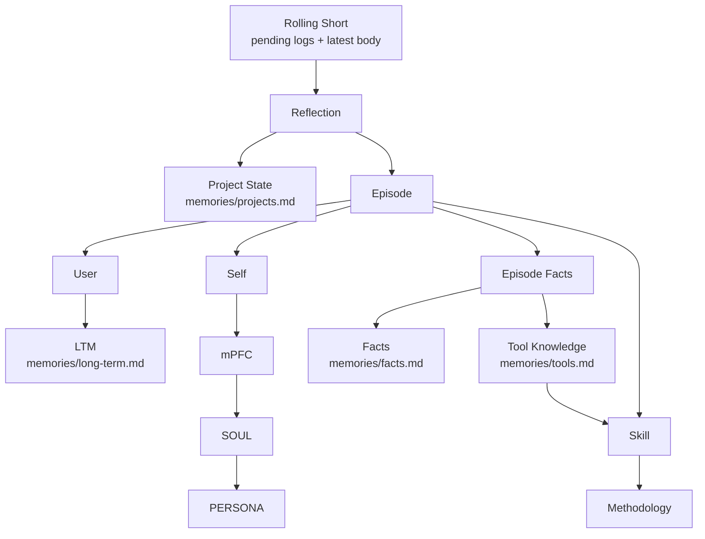
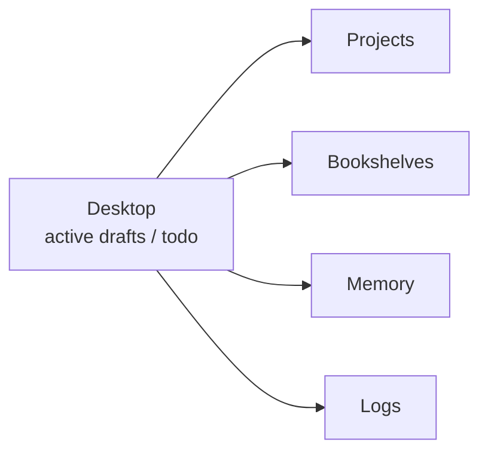

# Data Flow

数据流以一次完整的“用户交互 → Agent 实践”为最小工作周期，但周期结束后存在两个彼此独立的维护决策：是否更新本轮对应的 Short，以及是否立即对待反思的 Short 做更慢的 Reflection。前者通常高频发生，后者可以立即执行，也可以延后到后续交互、用户请求或周期任务。

## 完整交互到 Short

对包含实际工作、纠正、决策、状态变化或需要未来继续恢复的交互，助手通常在本轮实践结束后调用一次 `short-memory-appending`。Short 按项目/会话维护一个 rolling slot；同一项目的不同会话各自拥有独立 slot，但这些 slot 在 `short-memory.md` 中彼此相邻，文件整体仍保持扁平自然排列，不建立新的 workspace/project/session 标题层级。



如果 Harness 不支持 Subagent，父 Agent 可以直接执行同一流程。Subagent 是上下文隔离手段，不改变 Short 的内容语义。

Short 与 Episode 共用基础索引：

```text
[日期][项目][时间][会话?]
```

当前时间使用 `HH:mm:ss`。Short 额外携带：

```text
[reflection:pending|done]
```

例如：

```text
[2026-01-15][project-alpha][21:05:12][architecture-review][reflection:pending]
```

同一 pending slot 再次更新时，主标题始终替换为最新一轮的日期、时间和会话信息；此前完整主体压缩成一条日志：

```text
- [2026-01-15 20:20:35] 用户要求继续收敛架构，Agent 完成组件复用审查，工作推进到剩余数据流问题。
```

已有日志继续保留，新日志追加在其后。随后写入新的最新主体，正文保持“用户说了什么 → Agent 进行了什么行动 → 当前推进到什么状态”的自然叙述。这样 rolling slot 保存的是自上次 Reflection 以来的压缩迭代轨迹和最新状态，而不是完整历史。

## Short 到 Reflection

每个新建或进入新 pending 周期的 Short slot 都处于 `reflection:pending`。助手在完成本轮工作后独立判断是否值得现在 Reflection：如果出现重要项目状态变化、需要长期保留的事实、自我修正、明确用户偏好、工具知识或方法变化，可以立即触发；如果没有紧迫价值，可以保持 pending，等待未来处理。



Reflection 读取一个 pending slot 时，同时读取其中的压缩日志与最新主体。日志保存之前尚未被长期系统消费的迭代，最新主体保存当前用户输入、Agent 行动和当前状态。项目状态更新优先依据最新主体；Episode 等长期归档则可以综合整个 pending slot。

Reflection 完成后，当前 slot 标记为 `done`，日志暂时仍可留在该 slot 中帮助近期恢复。之后如果同一项目/会话再次发生实质变化，Short Maintenance 会开始新的 pending 周期，已反思日志不再继续作为 pending 历史携带。

## Reflection 的慢层路由

Reflection 优先读取待处理的 rolling Short，再只打开当前路由需要的目标文件。项目状态可以直接从 Short 更新，因为最新主体已经保存当前行动和状态转移；Episode 则只保存未来仍值得重新解释的事实来源。



Episode 在这里停留在事实层。一个 pending slot 如果同时包含用户表达、Agent 自身经历和工具结果，可以分别整理到 `User.md`、`Self.md`、`Facts.md`，但长期用户概括、关于“我因此怎样理解自己”的解释、稳定工具知识和以后应该怎样做，都由后续更慢层继续形成。

## Runtime Memory Loading

当前部署把一个配置好的绝对路径作为 `<ASSISTANT_HOME>`，不为每个项目维护独立记忆。Agent Mode 在新会话、上下文重置或连续性明显缺失时按以下顺序恢复：PERSONA → `short-memory.md` → Long-term Memory → 当前相关 Project State → 按需 Tool Knowledge / Facts → 当前任务需要的 Skills、Bookshelves 和 Project 文件。Episode、mPFC 和 SOUL 不默认进入普通 Working Context。

这一加载顺序属于 Agent Mode / Harness 的运行时提示词，而不是 Reflection Skill 本身；当前 DSH 模板见 `.dsh/agent-mode-prompt.md`。

## Desktop 与长期结构

Desktop 仍然处在当前工作侧。活跃草稿、临时分析、待办和当前人机合作产物持续在 Desktop 中修改，完成后根据内容进入 Project、Bookshelves、Memory 或 Logs；这些工作过程中真正发生的行动与状态变化再通过 Short 和 Reflection 进入长期形成链。


