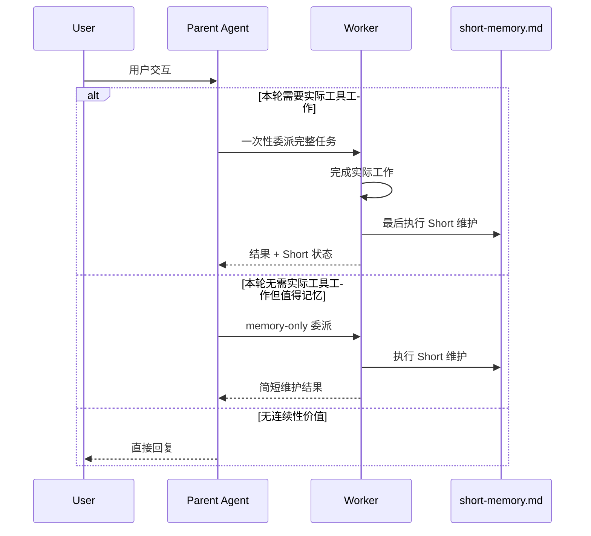
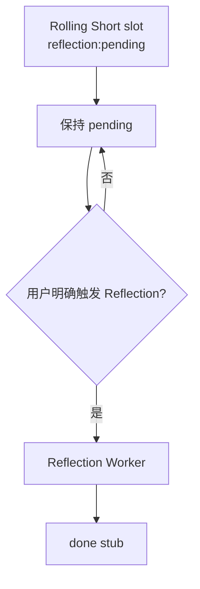
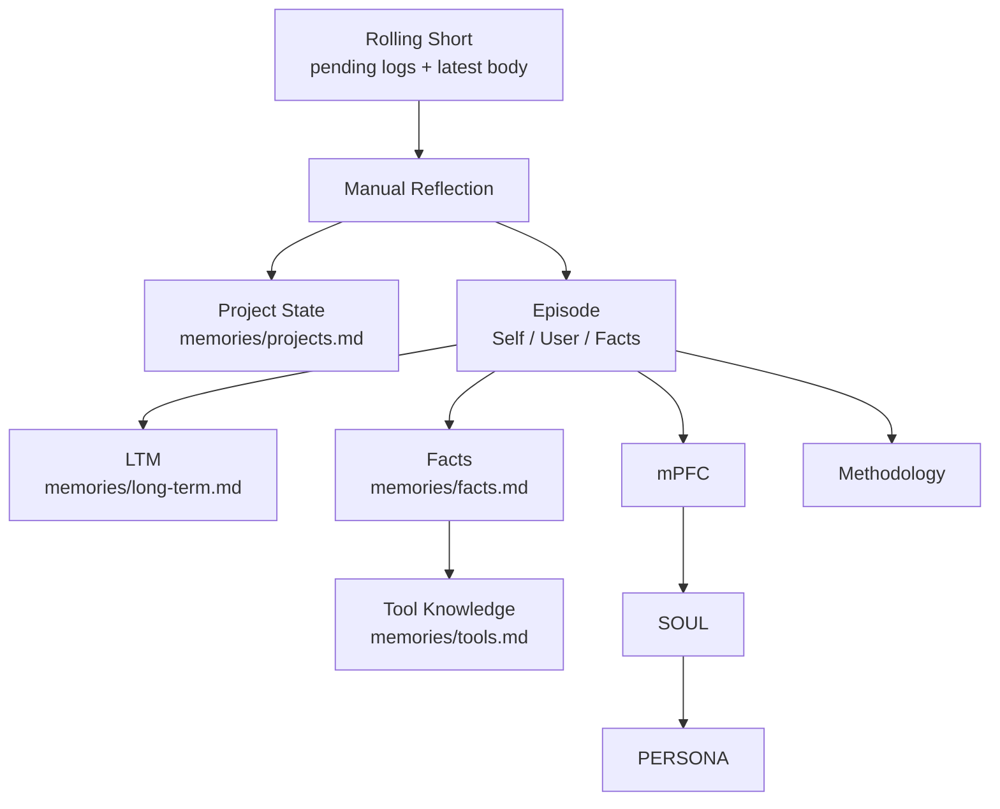
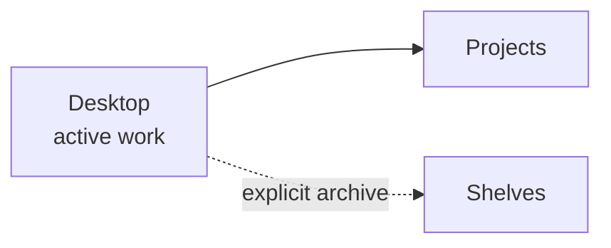

# Data Flow

数据流以一次完整的“用户交互 → Agent 实践”为最小工作周期。周期结束后只存在一个常规维护判断：是否需要更新本轮对应的 Short。Reflection 不属于每轮自动维护决策，只在用户明确手动触发时运行。

## 完整交互到 Short

对包含实际工作、纠正、决策、状态变化或需要未来继续恢复的交互，助手通常在本轮实践结束后调用一次 `short-memory-appending`。Short 按项目/会话维护一个 rolling slot；同一项目的不同会话各自拥有独立 slot，但这些 slot 在 `short-memory.md` 中彼此相邻，文件整体仍保持扁平自然排列。



Short 与 Episode 共用基础索引：

```text
[日期][项目[:会话]][时间]
```

项目/会话这一格按第一个 `:` 区分 project 与 session，session 内可以继续使用冒号表达稳定层级。Short 额外携带 Reflection 状态：

```text
[日期][项目[:会话]][时间][reflection:pending|done]
```

例如：

```text
[2026-09-13][home:research:cost-shifting][17:14:53][reflection:pending]
```

### pending rolling

同一 pending slot 再次更新时：

1. 保留已有压缩日志；
2. 把上一轮唯一 latest body 压成一条 `- [YYYY-MM-DD HH:mm:ss] ...` 日志；
3. 删除上一轮完整正文；
4. 更新 header 到当前时间；
5. 写入新的唯一 latest body。

禁止在旧正文后继续平铺新正文，也禁止反复压缩已有日志。日志只属于自己的 project/session slot，不从其他 slot 搬运背景。

Short 的最新正文只保存恢复当前工作线所需的变化、行动、当前状态、未收口项和关联文件。已有研究笔记、设计文档或 Project 文件承载的来源清单、详细论证、数字、引用和工具流水不应重复进入 Short。

## Short 到手动 Reflection

新建或更新后的 Short slot 保持 `reflection:pending`，直到用户明确要求 Reflection。Agent 不根据“重要程度”、pending 数量、时间阈值或 scheduler 自主触发 Reflection。



Reflection 读取一个 pending slot 时，同时读取其中的压缩日志与最新主体。项目状态更新优先依据当前状态；Episode 等长期归档综合整个尚未被消费的 pending 周期。

Reflection 完成后，当前 pending slot 不再保留日志和完整正文，而是压成 header + 一句 `reflection:done` stub。之后如果同一项目/会话再次发生实质变化，Short Maintenance 直接开始新的 pending 周期，不把 done stub 或已反思内容重新带回历史。

### completed-slot retention

每次手动 Reflection 结束时，同时根据部署已有的 Short retention policy 检查已经 `reflection:done` 的槽位：

- 超出保留期且不再活跃的 done slot 直接移除；
- 仍在保留期但沿用旧格式、保留大量正文或日志的 legacy done slot，只规范化为一句 done stub，不重新进入 Reflection；
- 没有配置 retention horizon 时，不自行发明时间窗口，只做 legacy done normalization。

## Reflection 的慢层路由

Reflection 只修改其明确授权的慢层目标：



Reflection 不自动把 Desktop 文件归档到 Shelves，也不修改 Research、Logs 或任意 Skill 文件。若证据提示这些位置应变化，Reflection 只报告建议，等待用户单独授权。

## Runtime Memory Loading

当前部署把一个配置好的绝对路径作为 `<ASSISTANT_HOME>`，不为每个项目维护独立记忆。Agent Mode 在新会话、上下文重置或连续性明显缺失时按以下顺序恢复：PERSONA → `short-memory.md` → Long-term Memory → 当前相关 Project State → 按需 Tool Knowledge / Facts → 当前任务需要的 Skills、Bookshelves 和 Project 文件。Episode、mPFC 和 SOUL 不默认进入普通 Working Context。

## Desktop 与长期结构

Desktop 是当前活跃工作面；Projects 是普通项目长期工作面；Shelves 是显式归档位。新讨论、研究和整理成果先在 Desktop 形成。用户明确要求归档后，才从 Desktop 整理进入 Shelves；归档完成且不再需要继续编辑时，默认把工作稿移出 Desktop，避免保留重复副本。



对已有 Shelves 旧文档，只有用户明确要求修订该文档时才允许直接修改而不经过 Desktop staging。
