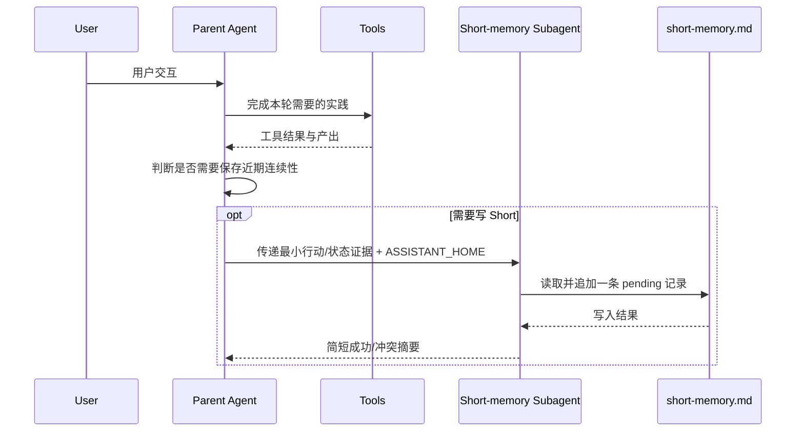
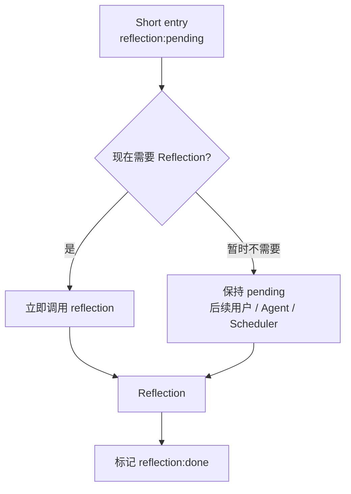
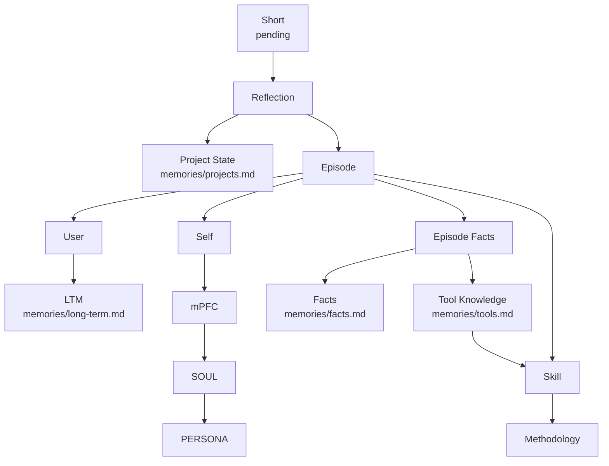
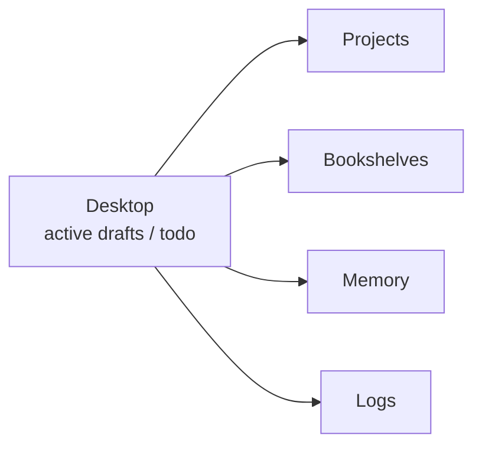

# Data Flow

数据流以一次完整的“用户交互 → Agent 实践”为最小工作周期，但周期结束后存在两个彼此独立的维护决策：是否把本轮写入 Short，以及是否立即对待反思的 Short 做更慢的 Reflection。前者通常高频发生，后者可以立即执行，也可以延后到后续交互、用户请求或周期任务。

## 完整交互到 Short

对包含实际工作、纠正、决策、状态变化或需要未来继续恢复的交互，助手通常在本轮实践结束后调用一次 `short-memory-appending`。该 Skill 将本轮值得保留的行动和行动后的项目/会话状态转移压缩成一条记录；不会因为一轮中调用了多个工具而生成多个 Short 条目。



如果 Harness 不支持 Subagent，父 Agent 可以直接执行同一写入流程。Subagent 是上下文隔离手段，不改变 Short 的内容语义。

Short 与 Episode 共用基础索引：

```text
[日期][项目][时间][会话?]
```

Short 额外携带：

```text
[reflection:pending|done]
```

例如：

```text
[2026-01-15][project-alpha][20:20][architecture-review][reflection:pending]
```

## Short 到 Reflection

新 Short 默认处于 `pending`。助手在完成本轮工作后独立判断是否值得现在 Reflection：如果出现重要项目状态变化、需要长期保留的事实、自我修正、明确用户偏好、工具知识或方法变化，可以立即触发；如果没有紧迫价值，可以保持 pending，等待未来批量处理。



Reflection 完成后，`done` 条目仍然保留在 Short 中，只要它仍处于固定保留周期或对近期连续性有价值。是否已反思和是否从 Short 删除是两件不同的事。

## Reflection 的慢层路由

Reflection 优先读取待处理的 Short，再只打开当前路由需要的目标文件。项目状态可以直接从 Short 更新，因为 Short 已经保存最新行动和状态转移；Episode 则只保存未来仍值得重新解释的事实来源。



Episode 在这里停留在事实层。一条 Short 如果同时包含用户表达、Agent 自身经历和工具结果，可以分别整理到 `User.md`、`Self.md`、`Facts.md`，但长期用户概括、关于“我因此怎样理解自己”的解释、稳定工具知识和以后应该怎样做，都由后续更慢层继续形成。

## Runtime Memory Loading

当前部署把一个配置好的绝对路径作为 `<ASSISTANT_HOME>`，不为每个项目维护独立记忆。Agent Mode 在新会话、上下文重置或连续性明显缺失时按以下顺序恢复：PERSONA → `short-memory.md` → Long-term Memory → 当前相关 Project State → 按需 Tool Knowledge / Facts → 当前任务需要的 Skills、Bookshelves 和 Project 文件。Episode、mPFC 和 SOUL 不默认进入普通 Working Context。

这一加载顺序属于 Agent Mode / Harness 的运行时提示词，而不是 Reflection Skill 本身；当前 DSH 模板见 `.dsh/agent-mode-prompt.md`。

## Desktop 与长期结构

Desktop 仍然处在当前工作侧。活跃草稿、临时分析、待办和当前人机合作产物持续在 Desktop 中修改，完成后根据内容进入 Project、Bookshelves、Memory 或 Logs；这些工作过程中真正发生的行动与状态变化再通过 Short 和 Reflection 进入长期形成链。


