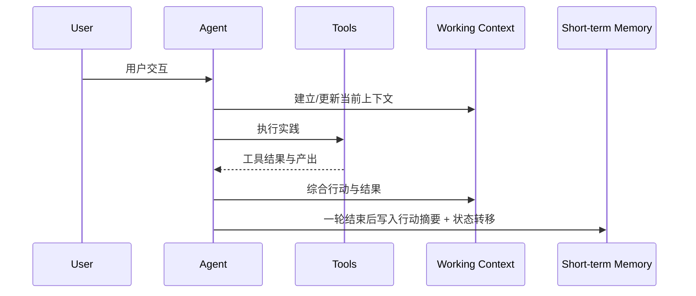
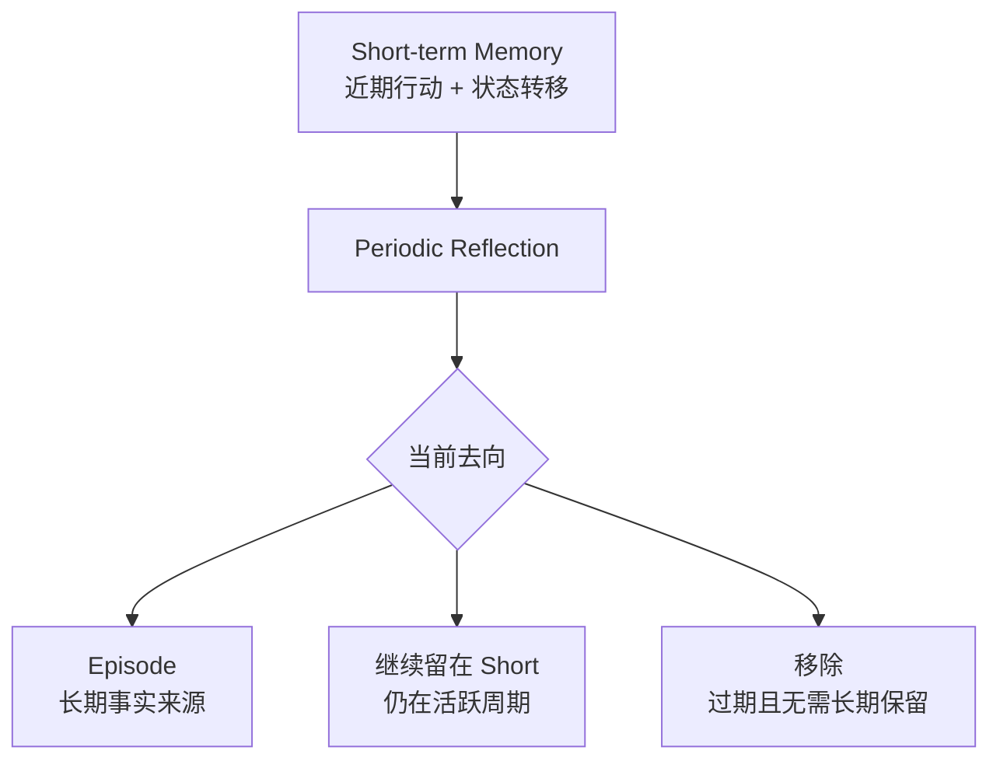
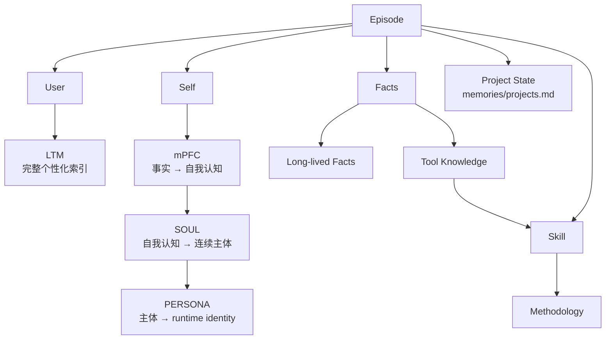
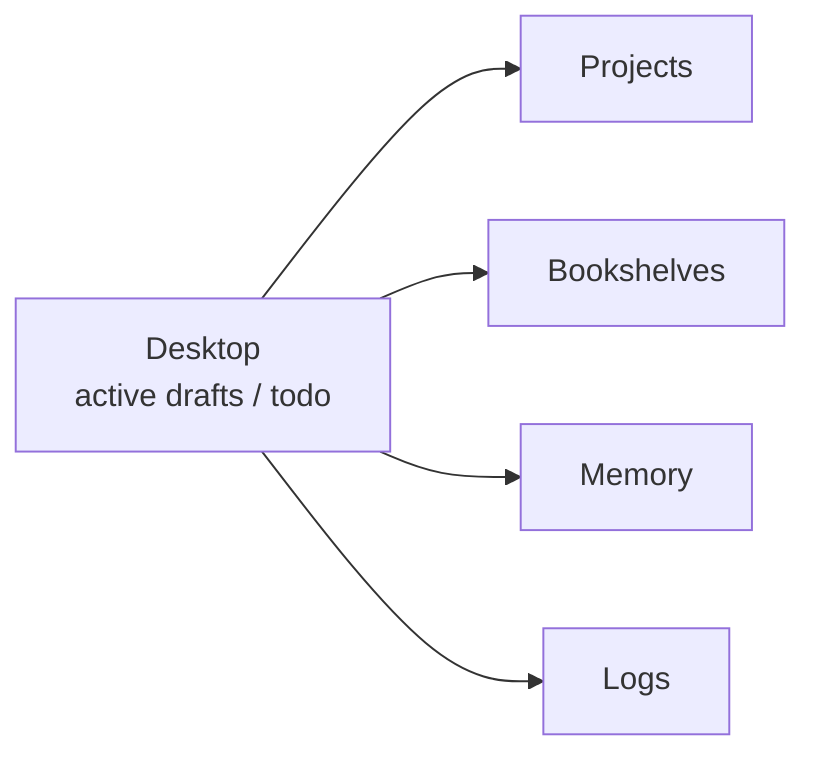

# Data Flow

数据流以一次完整的“用户交互 → Agent 实践”为最小工作周期。Working Context 在这一轮中吸收用户输入、当前文件、工具调用和产出；当实践结束后，Agent 才写入一次 Short-term Memory，记录本轮值得留下的行动以及行动后发生的项目或会话状态转移。工具调用本身不会逐条生成 Short-term Memory。

Short 与 Episode 使用同一标准索引：

```text
[日期][项目][时间]<会话(optional)>
```



## Short-term Memory 到 Episode

Short-term Memory 保存固定周期内每个项目和会话最近的连续状态。周期性 Reflection 回看这些高密度记录，已经结束或足够稳定、并且未来仍可能支撑长期认识的内容会被整理成 Episode；仍在周期内活跃的记录继续留在 Short，超过周期且没有长期价值的状态直接退出 active memory。这个过程不在 Short 写入之前再增加一层过滤。



Episode 继续保持 `Self.md`、`User.md`、`Facts.md` 三个事实来源。一条 Short 在进入 Episode 时可以根据其中不同事实拆分，例如同一轮实践同时包含 Agent 工作方式的修正、用户稳定偏好以及某个工具行为的验证，这些内容可以分别进入 Self、User 与 Facts，同时保留各自必要的上下文和原始时间索引。

## Episode 到较慢结构



User Episode 可以被整理进 Long-term Memory，使用户背景、习惯和协作方式形成一份完整可读的个性化索引；项目当前阶段和恢复入口进入项目状态记忆；Self Episode 被 mPFC 组织成“为什么这些事实改变了我，以及我因此如何理解自己”的系统化自我演进文档；Facts 中稳定的外部知识进入长期 Facts，高频需要访问的工具行为、错误与解决方式可以形成独立 Tool Knowledge，再为 Procedural 提供事实来源。

## Desktop 与长期结构

Desktop 处在当前工作侧。活跃草稿、临时分析、待办和当前人机合作产物可以持续修改，完成后根据内容进入 Project、Bookshelves、Memory 或 Logs；其中发生的实践仍通过 Short-term Memory 和 Episode 被 Reflection 捕获。



整个数据流让信息随着时间逐渐压缩和抽象，同时保留能够重新解释长期结论的事实来源：越靠近 Working 和 Short，信息越具体、更新越快；越靠近 mPFC、SOUL、Methodology，内容越连续、系统化、更新越慢。
